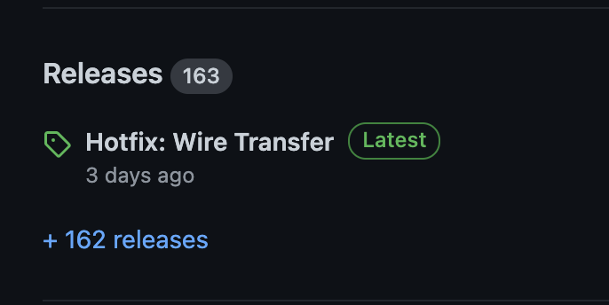
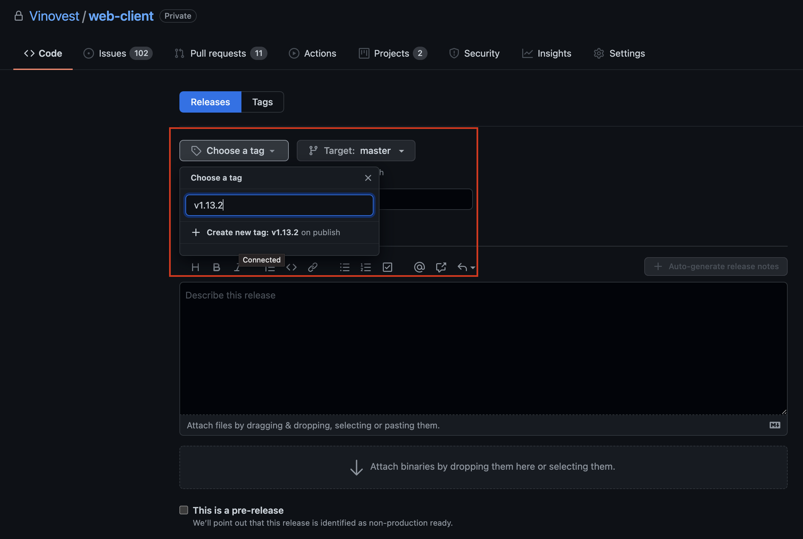
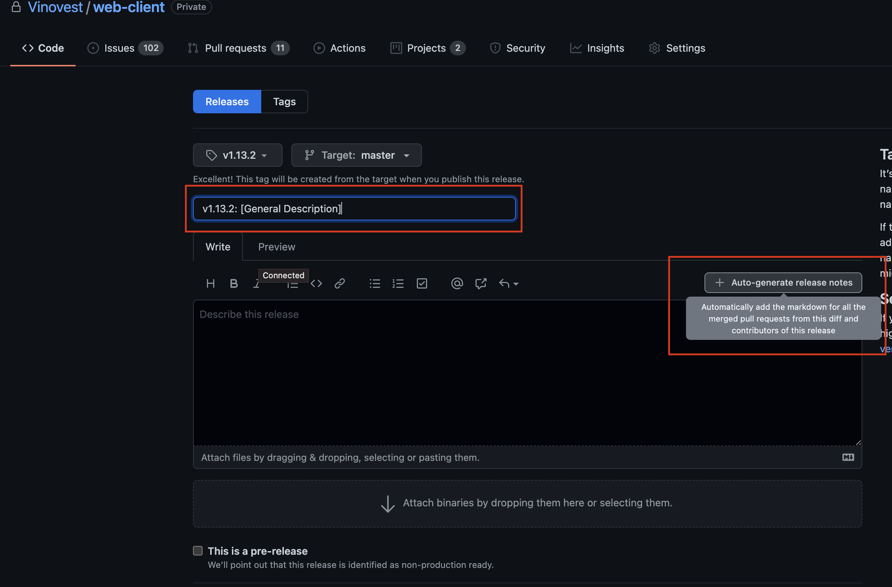

[](https://github.com/Vinovest/web-client/blob/master/package.json)
[](https://codeclimate.com/repos/5e331e275a3c3b75a000004e/maintainability)
[](http://commitizen.github.io/cz-cli/)
&nbsp;
[](https://app.circleci.com/pipelines/github/Vinovest/web-client?branch=master)


# Vinovest Webapp (v2.1)

This is the Vinovest web application, which can be found at:

-   [vinovest.co](https://vinovest.co)
-   [staging.vinovest.co](https://staging.vinovest.co)

## Required Tools

-   [node](https://nodejs.org/en/) >= 12
-   [yarn](https://yarnpkg.com/) >= 1.22.5
-   [nvm](https://github.com/nvm-sh/nvm)

## Getting Started

Get setup for @vinovest/components

1. Go to your personal github settings
2. Go to developer settings
3. Go to personal access tokens, generate and copy the token

### NOTE:
it is important that you select `repo` and `read:packages` options when generating your GH token.


Next, in your ~/.bashrc or ~/.zshrc add:

```shell
export GITHUB_TOKEN=[token you just made]
```

Now run `source ~/.bashrc` or `source ~/.zshrc` depending on your environment or just open a new tab.

Lastly, login with the following:

```shell
npm login --scope=@vinovest --registry=https://npm.pkg.github.com
```

Install dependencies (please use `yarn`)

```shell
git clone [this repo]
nvm install
yarn install
```

Compile and bring application in development mode

```shell
yarn start
```

The app can be accessed at [http://localhost:3000](http://localhost:3000)

For security reasons, please [run in a browser with CORS disabled!](https://alfilatov.com/posts/run-chrome-without-cors/)

## Before Committing

To ensure that we follow the correct format for changelog generation and versioning be sure to run the following command before committing:

```
git config core.hooksPath .githooks
```

## Compiling the app

Run the `build` command, which compiles the application in `--production` mode (with sourcemaps + performance optimizations), which outputs to the `/build` directory

```shell
$ yarn build
# outputs to the /build directory
```

## Test Credentials

[Plaid](https://plaid.com/docs/#test-credentials)

[Stripe](https://stripe.com/docs/testing#cards)

## Tests

```shell
yarn test
```

To update test failed on snapshots run:

```shell
yarn test -u
```

## Deployment

All CI/CD workflows can be accessible via [our configuration](https://github.com/Vinovest/web-client/blob/master/.circleci/config.yml)

All deployment workflows should be accessible in [CircleCI](https://circleci.com/gh/Vinovest/web-client)

### Staging Deploys

All `develop` merges, if tests pass, will auto-deploy to our staging site. Optionally, you can deploy a feature branch to staging to test your changes prior to merging your updates into `develop` by navigating to [CircleCI](https://app.circleci.com/pipelines/github/Vinovest/web-client) when a PR is open

To stage a branch for release, open a branch with with name convention of `staging/[YYYY-MM-DD]`. Deploy this branch to release hub with a PR open against `master`.


<details>
       <summary>
       Make the staging branch
       </summary>
       
   </details>

### Production Release

Production deploys will be kicked off by a new Git tag. Once your branch has passed
QA testing and is ready for release:

1. Merge and squash the staging branch into `master`.
2. <details>
       <summary>
       Open releases
       </summary>
       
   </details>
3. <details>
       <summary>
       Make tag for release <b>Make sure base branch is <code>master</code><b>
       </summary>
       
   </details>
4. <details>
       <summary>
       Write descriptive title and autogenerate changelog
       </summary>
       
   </details>
5. [Finally release the tag and check that your build is running on circleci.](https://app.circleci.com/pipelines/github/Vinovest/web-client?filter=mine)

### After release deployment

IMPORTANT: Merge the changes from master back into develop.

To do this, create a branch off of master called `hotfix/[ticket#]-[ticket_title]`. Once the branch has been verified as fixed go ahead and merge the ticket in and proceed with a release as usual. Version number for a hotfix should be a patch (eg. 1.1.1 -> 1.1.2).

<hr>
<br>

## Folder Structure

```shell

| -- .circleci # our CircleCI configuration
| -- .github # GitHub app configurations, such as Dependabot
| -- .githooks # Shareable git hooks
| -- public # CRA's reference dir for `index.html`
| -- src # all our source code
    | -- assets # many shared SVGs (or SVGs-as-React Components)
    | -- theme # contains our theme file for Styled Components
    | -- lib # custom clients for GTM + Sentry
    | -- models # custom data models, such as PaymentSource, FetchStatus
    | -- screens # route-level page Components
        | -- index.ts # React Router route configs
    | -- services
        | -- Storage # a caching helper
    | -- shared # as implied, a collection of shared components + assets
        | -- animations
        | -- components
        | -- context # separate React contexts - this should be cleaned up in the future
        | -- hooks # all our custom React hooks
        | -- ui # shared UI component helpers
    | -- stores # all our MobX stores, rootStore, and transport client
    | -- utils # shared helpers + constants
    | -- app.config.ts # reads from our environment variables, creates configuration object
    | -- App.tsx # root level components in tree
    | -- index.tsx # root level instantiation, where App.js gets invoked

```

## Relative Imports

Our `jsconfig` is set up to use the `/src` as the relative root. As such, you can define relative imports in relation to the `/src` dir when pulling in modules.

For instance,

```typescript
// from somewhere deeply nested
import module from "../../../../../assets/home/BankCircle.js";

// into...

import module from "#assets/home/BankCircle.js";
```

## Monitoring

Errors can be inspected in [Sentry](https://sentry.io/organizations/vinovest/issues/)

## Dependencies

We use GitHub's [Dependabot](https://dependabot.com/) to keep our dependencies up to date -- this is critical to ensure all security patches are applied as soon as they are available

Our Dependabot configuration (how many PRs, what interval) can be located at `.github/dependabot.yml`

## External Documentation

-   [Create React App](https://facebook.github.io/create-react-app/docs/getting-started)
-   [React](https://reactjs.org/)
-   [MobX](https://mobx.js.org/intro/concepts.html)
-   [Styled Components](https://styled-components.com/)
